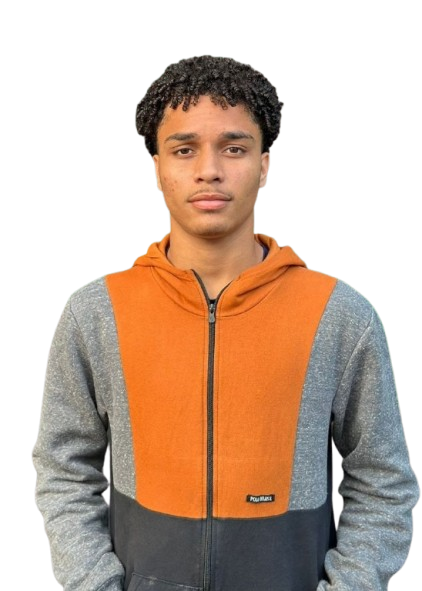

<!DOCTYPE html>
<html lang="pt-br">
<head>
  <meta charset="UTF-8">
  <meta name="viewport" content="width=device-width, initial-scale=1.0">
  <title>Currículo - Ícaro Henrique</title>
  
</head>
<body>

  <header>
    <h1>Currículo</h1>
    <h2>Ícaro Henrique Costa Silva</h2>
    
    <audio src="C.mp3" controls></audio>
    
<em>"Legião Urbana - Tempo Perdido"</em>

  </header>

  <main>
    <section>
      <h3>Dados Pessoais</h3>
      <ul>
        <li><strong>Endereço:</strong> Rua Margem da Linha, Nº 1059, Barreiro</li>
        <li><strong>Celular:</strong> (75) 99864-7725</li>
        <li><strong>Email:</strong> <a href="mailto:icarohenrrique44@gmail.com">icarohenrrique44@gmail.com</a></li>
      </ul>
    </section>

    <section>
      <h3>Escolaridade</h3>
      <ul>
        <li><strong>Ensino Médio Técnico</strong> – <a href="https://www.instagram.com/colegio.modelo.alagoinhas" target="_blank">C.M.L.E.M</a> – Completo</li>
        <li><strong>Sistemas de Informação</strong> – <a href="https://fsssacramento.br" target="_blank">F.S.SS.S.</a> – Em andamento</li>
      </ul>
    </section>

    <section>
      <h3>Cursos Extras</h3>
      <ul>
        <li><strong>Projetos de Sistemas Web</strong> – <a href="https://moodle.ifrs.edu.br/" target="_blank">IFRS</a> – 30 horas</li>
        <li><strong>Lógica de Programação Parte 1 e 2</strong> – <a href="https://moodle.ifrs.edu.br/" target="_blank">IFRS</a> – 96 horas</li>
        <li><strong>Python</strong> – <a href="https://www.santanderopenacademy.com/pt_br/index.html" target="_blank">Santander Open Academy</a> – 48 horas</li>
      </ul>
    </section>

    <section>
      <h3>Experiência Profissional</h3>
      <ul>
        <li><strong>Estagiário</strong> – <a href="https://www.instagram.com/cetep.lnab" target="_blank">CETEP/NLAB</a> – 6 meses</li>
      </ul>
    </section>
  </main>

</body>
</html>

  
